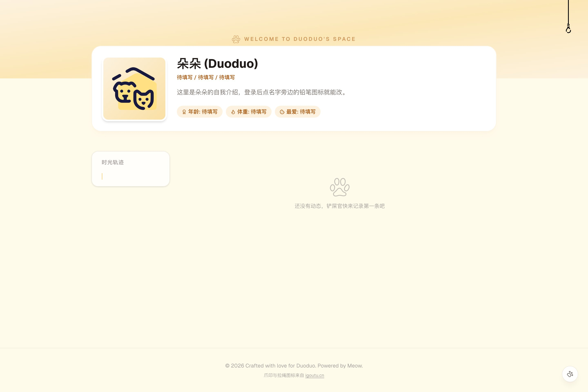
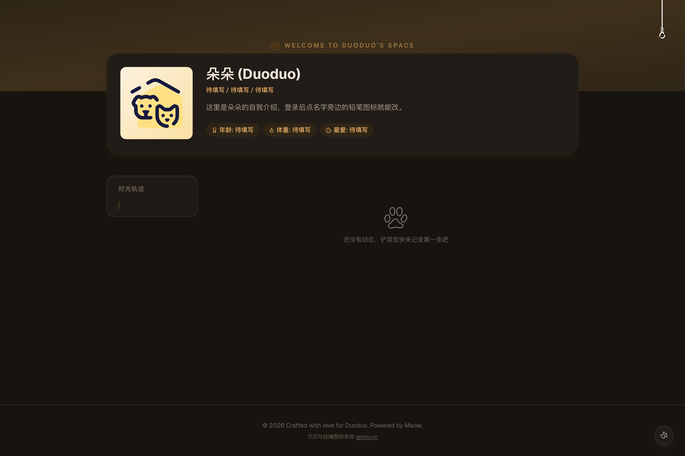

<div align="center">

# 🐾 朵朵的小窝

**一只猫咪的个人博客 · 记录每天的小事**

[](https://nextjs.org)
[](https://www.typescriptlang.org)
[](https://tailwindcss.com)
[](https://developers.cloudflare.com/d1/)
[](https://developers.cloudflare.com/r2/)
[](https://vercel.com)

**[在线访问 →](https://duoduo.abobb.com)**



</div>

---

一个为猫咪「朵朵」搭建的生活博客：访客可以浏览动态时间轴、点赞、评论；铲屎官登录后可以发布动态、上传照片、编辑猫咪档案。数据与图片全部存放在 Cloudflare（D1 + R2），应用托管在 Vercel，前后端同仓。

## ✨ 功能特性

- **猫咪档案** — 名字、头衔、头像、简介、年龄、体重、最爱零食，存于 D1，多端同步；登录后点击字段旁的铅笔图标即可编辑
- **动态时间线** — 按发布时间倒序展示；桌面端侧边「时光轨迹」锚点导航，移动端卡片内嵌月份标签
- **图片上传流水线** — 浏览器端先压缩再上传（`createImageBitmap` 解码 → canvas 缩放 → WebP 编码，动态图 1600px / 头像 512px 居中裁方），服务端**魔数校验**真实文件类型并拒收 SVG，杜绝改名伪装与 XSS 载体
- **点赞与评论** — 基于本地 visitor id 的点赞状态持久化；评论支持昵称 + 内容，悬停可删除
- **拉绳开关灯** — 深浅色主题切换做成了一根从天花板垂下来的拉绳：拉一下切换主题，绳子带回弹动画，偏好持久化、首次访问跟随系统
- **自绘日期时间控件** — 定时发布用的 DateTimePicker 组件，替代浏览器原生 `datetime-local`（shadow DOM 无法定制样式），支持滚动重定位与视口夹取
- **响应式布局** — 同一套云端数据，桌面 / 移动自动适配

<div align="center">
<table>
<tr>
<td align="center"><sub>浅色模式</sub></td>
<td align="center"><sub>深色模式（拉一下绳子）</sub></td>
</tr>
<tr>
<td></td>
<td></td>
</tr>
</table>
</div>

## 🧱 技术栈与架构

| 层 | 技术 |
|---|---|
| 框架 | Next.js 16（App Router）+ React 19 + TypeScript |
| 样式 | Tailwind CSS v4 · 设计令牌（`@theme`）驱动，深色模式 = 令牌整体翻转，页面代码零 `dark:` 变体 |
| 数据库 | Cloudflare D1（Serverless SQLite），REST API 读写 |
| 对象存储 | Cloudflare R2，图片公开访问走 `r2.dev` 自定义域 |
| 部署 | Vercel（托管应用 + 环境变量） |

```text
浏览器 ── 压缩后的图片 ──▶ /api/upload ── 魔数校验 ──▶ Cloudflare R2
   │                                                          │
   └── 发布动态 / 点赞 / 评论 ──▶ /api/posts ──▶ Cloudflare D1 ◀── 图片 URL 回写
```

## 🚀 快速开始

```bash
# 1. 安装依赖
npm install

# 2. 配置环境变量（复制后填入真实值）
cp .env.example .env.local

# 3. 本地开发
npm run dev        # http://localhost:3000

# 4. 生产构建
npm run build && npm start
```

### 环境变量

| 变量 | 说明 |
|---|---|
| `CLOUDFLARE_ACCOUNT_ID` | Cloudflare 账户 ID |
| `CLOUDFLARE_API_TOKEN` | API Token（需 D1 / R2 读写权限） |
| `CLOUDFLARE_D1_DATABASE_ID` | D1 数据库 ID |
| `CLOUDFLARE_R2_BUCKET` | R2 桶名（默认 `duoduo-photos`） |
| `CLOUDFLARE_R2_PUBLIC_URL` | R2 公开访问域，如 `https://pub-xxx.r2.dev` |

## ☁️ 部署

1. **Cloudflare 侧**：创建 D1 数据库与 R2 桶，绑定关系见 [`wrangler.toml`](wrangler.toml)；为 R2 桶开启公开访问（或绑定自定义域）
2. **Vercel 侧**：导入仓库，将上表中的 5 个变量配置到项目环境变量
3. 域名解析到 `cname.vercel-dns.com`（若经 Cloudflare 代理需关闭橙云，否则 Vercel 无法签发证书）

## 📁 目录结构

```text
├── app/
│   ├── api/            # posts / profile / upload / auth 接口
│   ├── layout.tsx      # 根布局 + 首帧前主题初始化脚本（防闪白）
│   ├── page.tsx        # 主页面（时间线、档案、管理面板）
│   └── globals.css     # 设计令牌：浅色 @theme + 深色 html.dark 覆写
├── components/
│   └── DateTimePicker.tsx   # 自绘日期时间选择器
├── lib/
│   ├── d1.ts           # D1 REST 客户端
│   ├── r2.ts           # R2 上传客户端
│   └── compress-image.ts    # 浏览器端图片压缩流水线
└── docs/screenshots/   # README 展示图
```

## 🖼️ 素材许可

页面中的爪印与拉绳图标来自 [icons8（igoutu.cn）](https://igoutu.cn/)，遵循其免费许可（署名 + 链回）。

---

<div align="center">

*Crafted with love for Duoduo. Powered by Meow.* 🐾

</div>
